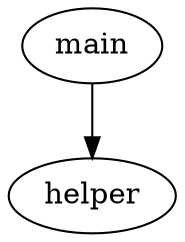

# FunctionCallReverseTool

[English](README.md) | [繁體中文](docs/README.zh-TW.md)

A unified function call graph and disassembly extraction framework for security researchers and reverse engineers. Extract function call relationships (DOT graph) and per-function disassembly (JSON) from binary files using a single CLI, regardless of which reverse engineering backend you use.

## Supported Backends

- **[Ghidra](https://ghidra-sre.org/)** - NSA's open-source reverse engineering framework with powerful analysis capabilities
- **[Radare2](https://www.radare.org/n/)** - Free and open-source reverse engineering framework supporting many architectures
- **[IDA Pro](https://www.hex-rays.com/products/ida/)** - *(Planned)* Industry-standard disassembler and debugger

## Installation

### Prerequisites

- Python 3.8+
- At least one supported backend installed:
  - **Ghidra**: Download from [ghidra-sre.org](https://ghidra-sre.org/), requires Java 17+
  - **Radare2**: Build from source or install via package manager

### Install Python Dependencies

```bash
pip install -r requirements.txt
```

### Install as CLI Tool (Optional)

```bash
pip install -e .
```

After installation, the `get-function-call` command will be available system-wide.

### Docker Deployment (Optional)

Pre-configured Docker environments are available in `deployment-scripts/`. See [deployment-scripts/README.md](deployment-scripts/README.md) for details.

## Usage

### Basic Syntax

```bash
# Run as module (no install required)
python -m function_call_tool -b <backend> -d <binary_directory> [options]

# Run after pip install -e .
get-function-call -b <backend> -d <binary_directory> [options]
```

### Command-Line Arguments

| Argument | Required | Description |
|----------|----------|-------------|
| `-b, --backend` | Yes | Backend to use: `ghidra` or `radare2` |
| `-d, --directory` | Yes | Path to directory containing binary files |
| `-o, --output` | No | Output directory (default: `<input_dir>_disassemble`) |
| `-t, --timeout` | No | Timeout per file in seconds (default: 600) |
| `--pattern` | No | Glob pattern to filter files (default: files without extensions) |
| `-g, --ghidra` | Ghidra only | Path to Ghidra `analyzeHeadless` script |

### Usage Examples

#### Ghidra Backend

```bash
# Basic usage
python -m function_call_tool -b ghidra -d /path/to/binaries -g ~/ghidra/support/analyzeHeadless

# Custom output directory
python -m function_call_tool -b ghidra -d /path/to/binaries -g ~/ghidra/support/analyzeHeadless -o /path/to/output

# Custom timeout (1200 seconds)
python -m function_call_tool -b ghidra -d /path/to/binaries -g ~/ghidra/support/analyzeHeadless -t 1200

# Process only .exe files
python -m function_call_tool -b ghidra -d /path/to/binaries -g ~/ghidra/support/analyzeHeadless --pattern "*.exe"

# All options combined
python -m function_call_tool -b ghidra -d /path/to/binaries -g ~/ghidra/support/analyzeHeadless -o /path/to/output -t 1200 --pattern "*.exe"
```

#### Radare2 Backend

```bash
# Basic usage
python -m function_call_tool -b radare2 -d /path/to/binaries

# Custom output directory
python -m function_call_tool -b radare2 -d /path/to/binaries -o /path/to/output

# Custom timeout (300 seconds)
python -m function_call_tool -b radare2 -d /path/to/binaries -t 300

# Process all files (including those with extensions)
python -m function_call_tool -b radare2 -d /path/to/binaries --pattern "*"

# All options combined
python -m function_call_tool -b radare2 -d /path/to/binaries -o /path/to/output -t 300 --pattern "*"
```

## Output Format

### Directory Structure

All backends produce the same output structure. Each binary gets its own subdirectory under `results/`:

```
output_dir/
├── results/
│   ├── binary_a/
│   │   ├── binary_a.dot
│   │   └── binary_a.json
│   └── binary_b/
│       ├── binary_b.dot
│       └── binary_b.json
├── extraction.log
└── timing.log
```

### DOT Format (Function Call Graph)

Each `.dot` file contains the function call graph in Graphviz DOT format:



### JSON Format (Function Disassembly)

Each `.json` file contains per-function disassembly information:

```json
{
    "0x1000": {
        "function_name": "main",
        "instructions": [
            "push rbp",
            "mov rbp, rsp",
            "call 0x1050"
        ]
    },
    "0x1050": {
        "function_name": "helper",
        "instructions": [
            "push rbp",
            "mov rbp, rsp",
            "ret"
        ]
    }
}
```

| Field | Type | Description |
|-------|------|-------------|
| Key (address) | str | Function entry point address (hex) |
| `function_name` | str | Function name |
| `instructions` | list[str] | Disassembled instructions |

### Log Files

- **extraction.log** - Records extraction success/failure for each file
- **timing.log** - Records processing time per file (`filename,seconds`)

## Project Structure

```
FunctionCallReverseTool/
├── pyproject.toml                 # Python packaging configuration
├── requirements.txt               # Python dependencies
├── function_call_tool/
│   ├── __init__.py
│   ├── __main__.py                # python -m entry point
│   ├── cli.py                     # CLI argument parsing and main()
│   ├── common.py                  # Shared logic (logging, parallel processing, output)
│   ├── backends/
│   │   ├── __init__.py            # Backend registry
│   │   ├── base.py                # BaseBackend ABC
│   │   ├── ghidra.py              # Ghidra backend
│   │   └── radare2.py             # Radare2 backend
│   └── scripts/
│       ├── ghidra_function_script.py  # Ghidra internal extraction script
│       └── r2_timeout_check.sh        # Radare2 timeout check
├── docs/                          # Translated documentation
├── deployment-scripts/            # Docker deployment configurations
├── test_benign_data/              # Sample benign test binaries
└── test_malware_data/             # Sample malware test binaries
```

## Features

- **Unified CLI** - Single command interface for all backends
- **Parallel Processing** - Multi-core CPU utilization for batch extraction
- **Timeout Protection** - Configurable per-file timeout to handle problematic binaries
- **Flexible File Filtering** - Glob pattern support for selecting specific file types
- **Consistent Output** - Identical DOT + JSON format and directory structure across all backends
- **Extensible Architecture** - ABC-based backend system for easy addition of new tools
- **Comprehensive Logging** - Separate extraction and timing logs for debugging and analysis
- **Resource Cleanup** - Automatic cleanup of temporary files after processing
- **Modern Packaging** - Supports `pip install` and `python -m` execution

## Adding a New Backend

Implement the `BaseBackend` abstract class:

```python
from function_call_tool.backends.base import BaseBackend

class MyBackend(BaseBackend):
    @classmethod
    def add_arguments(cls, parser):
        # Add backend-specific CLI arguments
        pass

    def validate_environment(self):
        # Check tool availability
        pass

    def extract_features(self, input_file, timeout, extraction_logger):
        # Return {'dot_content': str, 'functions': dict}
        pass
```

Then register it in `function_call_tool/backends/__init__.py`.

## License

This project is licensed under the MIT License - see the [LICENSE](LICENSE) file for details.
