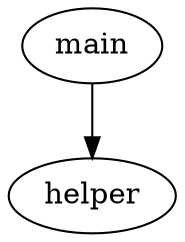

# FunctionCallReverseTool

[English](README.md) | [繁體中文](README.zh-TW.md)

統一的函數呼叫圖和反組譯提取框架，專為安全研究人員和逆向工程師設計。無論使用哪種逆向工程後端，都能透過單一 CLI 介面從二進位檔案中提取函數呼叫關係（DOT 圖）和逐函數反組譯資訊（JSON）。

## 支援的後端

- **[Ghidra](https://ghidra-sre.org/)** - 美國國家安全局開源的逆向工程框架，具備強大的分析能力
- **[Radare2](https://www.radare.org/n/)** - 免費開源的逆向工程框架，支援多種架構
- **[IDA Pro](https://www.hex-rays.com/products/ida/)** - *（計劃中）* 業界標準的反組譯器和除錯器

## 安裝

### 前置需求

- Python 3.8+
- 至少安裝一個支援的後端：
  - **Ghidra**：從 [ghidra-sre.org](https://ghidra-sre.org/) 下載，需要 Java 17+
  - **Radare2**：從原始碼編譯或透過套件管理器安裝

### 安裝 Python 依賴

```bash
pip install -r requirements.txt
```

### 安裝為 CLI 工具（可選）

```bash
pip install -e .
```

安裝後，可在系統任何位置直接使用 `get-function-call` 指令。

### Docker 部署（可選）

預設的 Docker 環境配置在 `deployment-scripts/` 中。詳見 [deployment-scripts/README.md](deployment-scripts/README.md)。

## 使用方法

### 基本語法

```bash
# 直接執行
python get_function_call.py -b <後端> -d <二進位檔案目錄> [選項]

# 以模組方式執行
python -m function_call_tool -b <後端> -d <二進位檔案目錄> [選項]

# pip install 後執行
get-function-call -b <後端> -d <二進位檔案目錄> [選項]
```

### 命令列參數

| 參數 | 必需 | 說明 |
|------|------|------|
| `-b, --backend` | 是 | 使用的後端：`ghidra` 或 `radare2` |
| `-d, --directory` | 是 | 包含二進位檔案的目錄路徑 |
| `-o, --output` | 否 | 輸出目錄（預設：`<input_dir>_disassemble`） |
| `-t, --timeout` | 否 | 每個檔案的超時時間（秒）（預設：600） |
| `--pattern` | 否 | 檔案過濾的 glob 模式（預設：無副檔名的檔案） |
| `-g, --ghidra` | 僅 Ghidra | Ghidra `analyzeHeadless` 腳本的路徑 |

### 使用範例

#### Ghidra 後端

```bash
# 基本使用
python get_function_call.py -b ghidra -d /path/to/binaries -g ~/ghidra/support/analyzeHeadless

# 自訂輸出目錄
python get_function_call.py -b ghidra -d /path/to/binaries -g ~/ghidra/support/analyzeHeadless -o /path/to/output

# 自訂超時時間（1200 秒）
python get_function_call.py -b ghidra -d /path/to/binaries -g ~/ghidra/support/analyzeHeadless -t 1200

# 僅處理 .exe 檔案
python get_function_call.py -b ghidra -d /path/to/binaries -g ~/ghidra/support/analyzeHeadless --pattern "*.exe"

# 組合所有選項
python get_function_call.py -b ghidra -d /path/to/binaries -g ~/ghidra/support/analyzeHeadless -o /path/to/output -t 1200 --pattern "*.exe"
```

#### Radare2 後端

```bash
# 基本使用
python get_function_call.py -b radare2 -d /path/to/binaries

# 自訂輸出目錄
python get_function_call.py -b radare2 -d /path/to/binaries -o /path/to/output

# 自訂超時時間（300 秒）
python get_function_call.py -b radare2 -d /path/to/binaries -t 300

# 處理所有檔案（包括有副檔名的）
python get_function_call.py -b radare2 -d /path/to/binaries --pattern "*"

# 組合所有選項
python get_function_call.py -b radare2 -d /path/to/binaries -o /path/to/output -t 300 --pattern "*"
```

## 輸出格式

### 目錄結構

所有後端產生相同的輸出結構。每個二進位檔案在 `results/` 下有獨立的子目錄：

```
output_dir/
├── results/
│   ├── binary_a/
│   │   ├── binary_a.dot
│   │   └── binary_a.json
│   └── binary_b/
│       ├── binary_b.dot
│       └── binary_b.json
├── extraction.log
└── timing.log
```

### DOT 格式（函數呼叫圖）

每個 `.dot` 檔案包含 Graphviz DOT 格式的函數呼叫圖：



### JSON 格式（函數反組譯資訊）

每個 `.json` 檔案包含逐函數的反組譯資訊：

```json
{
    "0x1000": {
        "function_name": "main",
        "instructions": [
            "push rbp",
            "mov rbp, rsp",
            "call 0x1050"
        ]
    },
    "0x1050": {
        "function_name": "helper",
        "instructions": [
            "push rbp",
            "mov rbp, rsp",
            "ret"
        ]
    }
}
```

| 欄位 | 型態 | 說明 |
|------|------|------|
| Key（地址） | str | 函數進入點地址（十六進位） |
| `function_name` | str | 函數名稱 |
| `instructions` | list[str] | 反組譯指令 |

### 日誌檔案

- **extraction.log** - 記錄每個檔案的提取成功/失敗
- **timing.log** - 記錄每個檔案的處理時間（`filename,seconds`）

## 專案結構

```
FunctionCallReverseTool/
├── get_function_call.py           # CLI 入口（薄包裝）
├── pyproject.toml                 # Python 打包配置
├── requirements.txt               # Python 依賴
├── function_call_tool/
│   ├── __init__.py
│   ├── __main__.py                # python -m 支援
│   ├── cli.py                     # CLI 參數解析和 main()
│   ├── common.py                  # 共用邏輯（日誌、並行處理、輸出）
│   └── backends/
│       ├── __init__.py            # 後端註冊表
│       ├── base.py                # BaseBackend ABC
│       ├── ghidra.py              # Ghidra 後端
│       └── radare2.py             # Radare2 後端
├── scripts/
│   ├── ghidra_function_script.py  # Ghidra 內部提取腳本
│   └── r2_timeout_check.sh        # Radare2 超時檢查
├── deployment-scripts/            # Docker 部署配置
├── test_benign_data/              # 範例良性測試二進位檔案
└── test_malware_data/             # 範例惡意軟體測試二進位檔案
```

## 功能特性

- **統一 CLI** - 所有後端使用單一命令介面
- **並行處理** - 利用多核心 CPU 進行批次提取
- **超時保護** - 可設定每個檔案的超時時間，處理有問題的二進位檔案
- **彈性檔案過濾** - 支援 glob 模式選擇特定檔案類型
- **一致的輸出** - 所有後端產生相同的 DOT + JSON 格式和目錄結構
- **可擴展架構** - 基於 ABC 的後端系統，輕鬆新增工具支援
- **完整日誌** - 分別記錄提取和計時日誌，便於除錯和分析
- **資源清理** - 處理完成後自動清理臨時檔案
- **現代打包** - 支援 `pip install`、`python -m` 和直接腳本執行

## 新增後端

實作 `BaseBackend` 抽象類別：

```python
from function_call_tool.backends.base import BaseBackend

class MyBackend(BaseBackend):
    @classmethod
    def add_arguments(cls, parser):
        # 新增後端專屬的 CLI 參數
        pass

    def validate_environment(self):
        # 檢查工具可用性
        pass

    def extract_features(self, input_file, timeout, extraction_logger):
        # 回傳 {'dot_content': str, 'functions': dict}
        pass
```

然後在 `function_call_tool/backends/__init__.py` 中註冊。

## 授權

本專案採用 MIT 授權條款 - 詳見 [LICENSE](LICENSE) 檔案。
